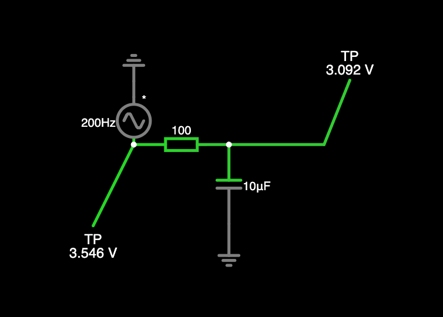

## LEYENDA DE MAGNITUDES

```md
| Magnitud                  | Símbolo | Unidad       | Qué representa                                    | Componente típico    |
| ------------------------- | ------- | ------------ | ------------------------------------------------- | -------------------- |
| Voltaje                   | V       | Volt (V)     | Diferencia de potencial eléctrico                 | Todos                |
| Corriente                 | I       | Ampere (A)   | Flujo de carga eléctrica                          | Todos                |
| Resistencia               | R       | Ohm (Ω)      | Oposición al paso de corriente                    | Resistor             |
| Potencia                  | P       | Watt (W)     | Energía consumida o entregada                     | Todos                |
| Capacitancia              | C       | Farad (F)    | Capacidad de almacenar carga                      | Capacitor            |
| Inductancia               | L       | Henry (H)    | Capacidad de almacenar energía en campo magnético | Inductor             |
| Frecuencia                | f       | Hertz (Hz)   | Número de ciclos por segundo                      | Señales AC           |
| Periodo                   | T       | segundos (s) | Duración de un ciclo                              | Señales AC           |
| Caída de voltaje directa  | Vf      | Volt (V)     | Voltaje necesario para que un diodo conduzca      | Diodo / LED          |
| Voltaje Zener             | Vz      | Volt (V)     | Voltaje de regulación en inversa                  | Diodo Zener          |
| Ganancia de corriente     | hFE o β | —            | Relación entre corriente de colector y base       | Transistor BJT       |
| Corriente de base         | Ib      | Ampere (A)   | Corriente de control del BJT                      | BJT                  |
| Corriente de colector     | Ic      | Ampere (A)   | Corriente principal en BJT                        | BJT                  |
| Voltaje base-emisor       | Vbe     | Volt (V)     | Voltaje necesario para activar BJT (~0.7V)        | BJT                  |
| Voltaje colector-emisor   | Vce     | Volt (V)     | Voltaje entre colector y emisor                   | BJT                  |
| Voltaje umbral            | Vth     | Volt (V)     | Voltaje mínimo para encender MOSFET               | MOSFET               |
| Resistencia en conducción | Rds(on) | Ohm (Ω)      | Resistencia interna cuando MOSFET está encendido  | MOSFET               |
| Corriente de drenador     | Id      | Ampere (A)   | Corriente principal del MOSFET                    | MOSFET               |
| Tiempo de subida/bajada   | tr / tf | segundos (s) | Velocidad de conmutación                          | Transistores         |
| Eficiencia                | η       | %            | Qué tan bien convierte energía                    | Fuentes, reguladores |
```


# DIODOS

Los diodos son dispositivos semiconductores que permiten el paso de corriente eléctrica en un solo sentido y bloquean su circulación en el contrario. Su funcionamiento se basa en la polarización: conducen cuando están polarizados en directo y se comportan como un interruptor abierto en polarización inversa. Entre sus características principales están la caída de voltaje en conducción, su capacidad de rectificar señales (como convertir corriente alterna en continua) y su uso en protección de circuitos, regulación de voltaje (como los diodos Zener) y manejo de señales. Son componentes esenciales para controlar dirección, estabilidad y seguridad en los circuitos electrónicos.

## Steering — Diodo OR (selección de fuente)
Dos fuentes, el diodo con mayor tensión "gana" y alimenta la carga.

```sh
<cir f="1" ts="0.000005" ic="10.20027730826997" cb="50" pb="43" vr="5" mts="5e-11">
  <v x="96 336 96 160" f="0" wf="0" maxv="9"/>
  <v x="256 336 256 160" f="0" wf="0" maxv="12"/>
  <d x="96 160 176 160" f="2" mo="default"/>
  <d x="256 160 176 160" f="2" mo="default"/>
  <r x="176 160 176 336" f="0" r="1000"/>
  <w x="96 336 176 336" f="0"/>
  <w x="256 336 176 336" f="0"/>
  <g x="176 336 176 368" f="0"/>
  <TestPoint x="176 160 176 128" f="0" me="0"/>
</cir>
```

## Rectificador de media onda (Switching básico)


```sh
$ 1 0.000005 10.20027730826997 50 5 43 5e-11
v 80 304 80 144 0 1 60 10 0 0 0.5
d 80 144 208 144 2 default
r 208 144 208 304 0 1000
w 80 304 208 304 0
g 80 304 80 336 0 0
368 208 144 208 112 0 0
```

## Diodo Schottky — Convertidor Buck simplificado
El diodo Schottky actúa como "freewheeling" cuando el switch abre.

```sh
$ 1 0.000005 10.20027730826997 50 5 43 5e-11
v 64 320 64 128 0 0 40 12 0 0 0.5
s 64 128 176 128 0 0 false
l 176 128 272 128 0 0.001 0
r 272 128 272 320 0 100
d 176 320 176 128 2 schottky
w 64 320 176 320 0
w 176 320 272 320 0
g 64 320 64 352 0 0
368 272 128 272 96 0 0
```

## Protección de polaridad inversa
Un diodo en serie bloquea si conectas la batería al revés.

```sh
$ 1 0.000005 10.20027730826997 50 5 43 5e-11
v 64 304 64 144 0 0 40 9 0 0 0.5
d 64 144 192 144 2 default
r 192 144 192 304 0 470
w 64 304 192 304 0
g 64 304 64 336 0 0
368 192 144 192 112 0 0
```

---

# TRANSISTORES

Los transistores son dispositivos electrónicos semiconductores que se utilizan para controlar el flujo de corriente en un circuito. Funcionan principalmente como interruptores o amplificadores: pueden encender o apagar el paso de corriente, o bien aumentar una señal eléctrica débil para hacerla útil en otras partes del sistema. Son componentes fundamentales en la electrónica moderna, ya que permiten que señales pequeñas, como las de un microcontrolador, controlen dispositivos más grandes como luces, motores o sistemas de comunicación.

---

## BJT NPN

### Descripción general

El circuito es un sistema de control donde una señal de bajo voltaje decide si un LED, alimentado con un voltaje mayor, se enciende o se apaga. Para lograr esto se utiliza un transistor tipo BJT como interruptor electrónico.

---

### Funcionamiento por partes

Primero, hay una fuente principal de mayor voltaje que alimenta el LED. Antes de llegar al LED, la corriente pasa por una resistencia que limita la cantidad de corriente para evitar dañarlo.

El LED está conectado al transistor, el cual actúa como un interruptor que conecta o desconecta el camino hacia tierra. Si el transistor permite el paso de corriente, el LED se enciende; si no, permanece apagado.

Por otro lado, el transistor se controla mediante una segunda fuente de menor voltaje. Esta fuente está conectada a la base del transistor a través de una resistencia que protege el dispositivo limitando la corriente de control.

---

### Estado actual del circuito

En este caso específico, la fuente de control está en cero voltios. Esto significa que no hay señal aplicada a la base del transistor.

Como resultado:
- El transistor permanece apagado  
- No hay paso de corriente desde el LED hacia tierra  
- El LED no se enciende  

---

### Idea clave

El circuito permite que una señal pequeña controle una carga alimentada con mayor voltaje. El transistor funciona como un interruptor controlado electrónicamente.

---

### Conclusión

Este tipo de circuito es fundamental en electrónica porque permite separar el control de la potencia. Es la base de sistemas donde un microcontrolador o señal débil maneja dispositivos más grandes como luces, motores o relés.

```sh
<cir f="1" ts="0.000005" ic="10.20027730826997" cb="50" pb="43" vr="5" mts="5e-11">
  <v x="96 416 96 96" f="16" wf="0" maxv="12"/>
  <r x="96 96 240 96" f="0" r="470"/>
  <dm nm="fwdrop=2" f="0" is="1.6187619680992456e-17" rs="0" n="2" bv="0"/>
  <LED x="240 96 240 224" f="1" mo="fwdrop=2" cr="0" cg="0.1" cb="0.5" mbc="0.01"/>
  <t x="336 240 240 240" f="0" pn="1" be="100" mo="default" vbe="-11.26775177809163" vbc="1.1367751772559806e-7"/>
  <r x="336 96 336 240" f="0" r="10000"/>
  <v x="336 416 336 96" f="16" wf="0" maxv="0"/>
  <w x="240 256 240 416" f="3"/>
  <w x="96 416 240 416" f="0"/>
  <w x="240 416 336 416" f="0"/>
  <g x="240 416 240 448" f="0"/>
  <TestPoint x="240 96 240 64" f="0" me="0"/>
</cir>
```
---

---

## MOSFET

### Descripción general

El circuito es un sistema de control en el que una señal de bajo voltaje intenta controlar el encendido de un LED alimentado por una fuente de mayor voltaje. En este caso, se utiliza un MOSFET como interruptor electrónico en lugar de un transistor BJT.

---

### Funcionamiento por partes

Una fuente principal proporciona el voltaje que alimenta al LED. Antes de llegar al LED, la corriente pasa por una resistencia que limita su valor para protegerlo.

El LED está conectado al MOSFET, que actúa como un interruptor entre el LED y tierra. Cuando el MOSFET conduce, permite que la corriente circule y el LED se encienda. Cuando no conduce, el circuito queda abierto y el LED permanece apagado.

El MOSFET se controla mediante una segunda fuente de menor voltaje conectada a su terminal de control (gate) a través de una resistencia. Esta resistencia ayuda a proteger el dispositivo y estabilizar la señal de control.

---

### Estado actual del circuito

En este caso, la fuente de control está en cero voltios. Esto significa que no hay señal aplicada al gate del MOSFET.

Como resultado:

* El MOSFET permanece apagado
* No hay paso de corriente a través del LED
* El LED no se enciende

---

### Idea clave

El circuito muestra cómo un MOSFET puede utilizarse como un interruptor controlado por voltaje. A diferencia del transistor BJT, no requiere corriente continua en la entrada, sino únicamente una diferencia de voltaje para activarse.

---

### Conclusión

Este tipo de configuración es muy común en electrónica moderna, especialmente cuando se necesita eficiencia en el control. Permite que señales pequeñas controlen cargas más grandes con menor pérdida de energía, siendo ideal para aplicaciones con microcontroladores.


```sh
<cir f="1" ts="0.000005" ic="10.20027730826997" cb="50" pb="43" vr="5" mts="5e-11">
  <v x="96 416 96 96" f="16" wf="0" maxv="12"/>
  <r x="96 96 240 96" f="0" r="470"/>
  <dm nm="fwdrop=2" f="0" is="1.6187619680992456e-17" rs="0" n="2" bv="0"/>
  <LED x="240 96 240 224" f="1" mo="fwdrop=2" cr="0" cg="0.1" cb="0.5" mbc="0.01"/>
  <f x="288 240 240 240" f="0" vt="1.5" be="0.02"/>
  <r x="368 240 368 176" f="0" r="1000"/>
  <v x="368 416 368 240" f="16" wf="0" maxv="5"/>
  <w x="240 256 240 416" f="0"/>
  <w x="96 416 240 416" f="0"/>
  <w x="240 416 368 416" f="0"/>
  <g x="240 416 240 448" f="0"/>
  <TestPoint x="240 96 240 64" f="0" me="0"/>
  <s x="368 176 288 176" f="0"/>
  <w x="288 176 288 240" f="0"/>
</cir>
```

# CIRCUITOS PRACTICOS
## FILTRO DE SUAVIZADO DE SEÑALES (EFECTO DEBOUNCE) CON RC



```sh
<cir f="1" ts="0.000005" ic="32.755850052045055" cb="50" pb="50" vr="5" mts="5e-11">
  <v x="112 80 112 32" f="0" wf="1" fr="200" maxv="5"/>
  <r x="112 80 208 80" f="0" r="100"/>
  <w x="208 80 304 80" f="0"/>
  <c x="208 80 208 160" f="0" c="0.00001" iv="0.001" sr="0" vd="2.5912589861277677"/>
  <g x="208 160 208 192" f="0"/>
  <w x="112 32 112 16" f="0"/>
  <g x="112 16 112 0" f="0"/>
  <TestPoint x="304 80 336 0" f="0" me="0"/>
  <TestPoint x="112 80 64 176" f="0" me="0"/>
  <o en="8" sp="64" f="x102" p="0">
    <p v="0" sc="5"/>
    <p v="3" sc="6.4"/>
  </o>
  <o en="7" sp="64" f="x102" p="1">
    <p v="0" sc="5"/>
  </o>
</cir>
```


# Tus valores

De tu circuito:

* Frecuencia: **200 Hz**
* R = **100 Ω**
* C = **10 µF**

---

#  Tiempo RC
$$
\tau = R \cdot C = 100 \cdot 0.00001 = 0.001\,s = 1\,ms
$$

Tu filtro responde en **1 ms**

---

# Periodo de la señal

$$
T = \frac{1}{200} = 0.005\,s = 5\,ms
$$

Cada ciclo dura **5 ms**