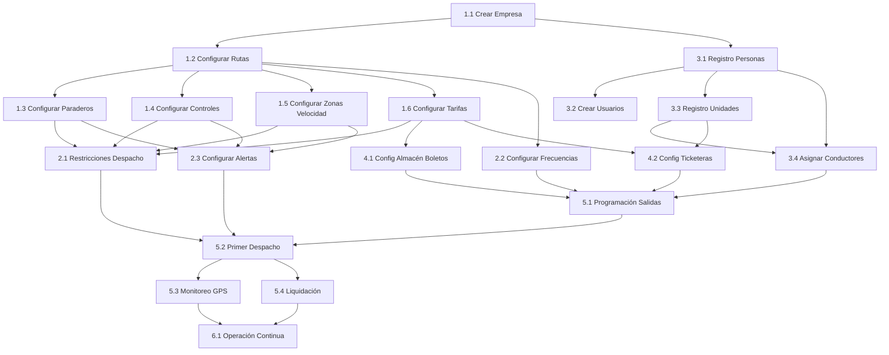

# GUÍA DE IMPLEMENTACIÓN DEL SISTEMA DE GESTIÓN DE TRANSPORTE

## INTRODUCCIÓN

Esta guía establece el proceso paso a paso para implementar y poner en operación el sistema de gestión de transporte. Los pasos están ordenados según dependencias técnicas y lógica operativa.

---

## FASE 1: CONFIGURACIÓN INICIAL DE LA EMPRESA

### **PASO 1.1: Creación de Entidad Empresarial**

**Responsable:** Gerente de TI / Administrador de Sistemas

**Requisitos previos:** Acceso administrativo al sistema

**Acciones:**
1. Crear entidad empresa en el sistema
   - Razón social
   - RUC
   - Dirección legal
   - Datos de contacto (teléfono, email)
   - Logo de la empresa
   - Información tributaria

2. Configurar datos generales operativos
   - Horarios de operación (5:00 - 23:00)
   - Turnos de trabajo (mañana, tarde, noche)
   - Tipo de servicio (urbano, interurbano)
   - Modalidad de operación (con/sin programación)

**Salida:** Entidad empresa creada y configurada en el sistema

---

### **PASO 1.2: Configuración de Rutas**

**Responsable:** Jefe de Operaciones / Gerente de Operaciones

**Requisitos previos:** Entidad empresa creada

**Acciones:**

1. **Definir nomenclatura de rutas**
   - Asignar códigos/nombres (Ej: Ruta 100, 101, 102)
   - Definir nombres descriptivos (Ej: "Centro - San Juan", "Lima - Callao")

2. **Configurar tipo de ruta**
   - **Ruta Circular:** Un solo terminal, recorrido cerrado
   - **Ruta Lineal:** Dos terminales (Lado A ↔ Lado B)
   - Especificar terminales asociados

3. **Diseñar recorrido de ruta** (Módulo: Diseño de Ruta)
   - Trazar polilínea del recorrido en mapa para ambos sentidos
   - Guardar trazado seleccionando la línea dibujada
   - Repetir para sentido de retorno (si aplica)

4. **Configurar Geocerca de Ruta**
   - Definir área/corredor permitido de circulación
   - Establecer tolerancia de desviación (Ej: ±100 metros)
   - Guardar haciendo clic dentro de la línea dibujada
   - El sistema alertará cuando una unidad salga de esta geocerca

**Salida:** Rutas creadas con recorridos y geocercas definidas

---

### **PASO 1.3: Configuración de Paraderos**

**Responsable:** Jefe de Operaciones

**Requisitos previos:** Rutas creadas y trazadas

**Acciones:**

1. **Crear paraderos oficiales**
   - Nombre del paradero (Ej: "Av. Principal altura calle 5")
   - Coordenadas GPS (latitud, longitud)
   - Número de orden secuencial en la ruta
   - Tipo: Terminal, paradero intermedio, paradero principal

2. **Definir geocercas circulares por paradero**
   - Radio de detección (típicamente 30-50 metros)
   - Vincular a la ruta correspondiente
   - Marcar paraderos principales para validación de cumplimiento

**Salida:** Paraderos georeferenciados y asociados a rutas

---

### **PASO 1.4: Configuración de Controles de Paso**

**Responsable:** Jefe de Operaciones

**Requisitos previos:** Rutas trazadas

**Acciones:**

1. **Definir puntos de control de paso**
   - Coordenadas GPS (latitud, longitud)
   - Número de orden de creación
   - Nombre descriptivo (Ej: "Control Entrada Centro")
   - Tipo: Terminal, Control intermedio

2. **Configurar tiempos esperados por franja horaria**
   - Definir tiempo mínimo y máximo entre controles
   - Ejemplo:
     ```
     Control 1 → Control 2
     - 05:00-09:00: 15-20 min
     - 09:00-18:00: 12-18 min
     - 18:00-23:00: 15-22 min
     ```

3. **Establecer calificaciones/ponderados**
   - Marcar controles para "Hora de Ruta" (HR)
   - Marcar "Controles Principales" (CP) para validación estricta
   - Asignar ponderación para evaluación de cumplimiento

**Salida:** Controles de paso configurados con tiempos esperados

---

### **PASO 1.5: Configuración de Zonas de Velocidad**

**Responsable:** Jefe de Operaciones

**Requisitos previos:** Rutas trazadas

**Acciones:**

1. **Definir geocercas poligonales para zonas de velocidad**
   - Zona urbana general: Máx 50 km/h
   - Zona escolar: Máx 30 km/h
   - Avenidas principales: Máx 60 km/h
   - Zonas de riesgo: Velocidades personalizadas

2. **Configurar alertas de velocidad**
   - Umbral de alerta (Ej: > 80 km/h → Alerta ALTA)
   - Responsables de notificación (Monitoreador GPS, Supervisor)

**Salida:** Zonas de velocidad delimitadas y alertas configuradas

---

### **PASO 1.6: Configuración de Tarifas y Boletos**

**Responsable:** Gerente Financiero / Jefe de Liquidación

**Requisitos previos:** Rutas creadas

**Acciones:**

1. **Crear tipos de boletos**
   - Boleto general/adulto (Ej: S/ 2.50)
   - Boleto escolar (Ej: S/ 1.25)
   - Boleto universitario (Ej: S/ 1.50)
   - Boleto especial (tercera edad, discapacidad)

2. **Asociar tarifas a rutas**
   - Definir qué tipos de boletos aplican por ruta
   - Configurar tramos tarifarios si aplica

3. **Configurar series de boletos físicos**
   - Series habilitadas (Ej: Serie A, Serie B)
   - Rangos numéricos por serie
   - Estado (activo, agotado)

**Salida:** Catálogo de tarifas y boletos configurado

---

## FASE 2: CONFIGURACIÓN DE PARÁMETROS OPERATIVOS

### **PASO 2.1: Configuración de Restricciones de Despacho**

**Responsable:** Gerente de Operaciones / Jefe de Operaciones

**Requisitos previos:** Rutas y tarifas configuradas

**Acciones:**

1. **Definir restricciones documentales**
   - Documentos obligatorios para despacho:
     * Licencia de conducir vigente
     * Certificado técnico vehicular vigente
     * SOAT vigente
     * Tarjeta de propiedad
   - Configurar días de anticipación para alerta de vencimiento (Ej: 15 días)
   - Definir si bloquea despacho o solo alerta

2. **Configurar restricciones de suministros**
   - Stock mínimo de combustible (Ej: ≥ 25%)
   - Stock mínimo de boletos (Ej: ≥ 50 unidades)
   - Validación de ticketera operativa (opcional)

3. **Configurar validación GPS**
   - Unidad debe estar dentro de geocerca de terminal
   - GPS debe tener señal activa (≥ 80%)

**Salida:** Reglas de validación pre-despacho configuradas en `TbConfiguracion`

---

### **PASO 2.2: Configuración de Intervalos de Frecuencia**

**Responsable:** Analista de Operaciones

**Requisitos previos:** Rutas configuradas

**Acciones:**

1. **Definir frecuencias objetivo por franja horaria**
   ```
   RUTA 100 - Frecuencia Variable
   
   Franja Horaria    | Frecuencia Objetivo | Unidades Necesarias
   ------------------|---------------------|--------------------
   05:00 - 06:00     | 15 minutos          | 4
   06:00 - 09:00     | 8 minutos           | 8
   09:00 - 12:00     | 12 minutos          | 6
   12:00 - 14:00     | 10 minutos          | 6
   14:00 - 18:00     | 12 minutos          | 6
   18:00 - 21:00     | 8 minutos           | 8
   21:00 - 23:00     | 15 minutos          | 4
   ```

2. **Configurar en tabla `TbIntervaloFrecuencia`**
   - Ruta ID
   - Hora inicio
   - Hora fin
   - Intervalo en minutos
   - Días de aplicación (L-V, S, D)

**Salida:** Frecuencias objetivo configuradas por ruta y horario

---

### **PASO 2.3: Configuración de Alertas Automáticas**

**Responsable:** Jefe de Operaciones

**Requisitos previos:** Geocercas y controles configurados

**Acciones:**

1. **Configurar reglas de alertas GPS**
   - Salida de geocerca > 5 min → Alerta MEDIA
   - Velocidad > 80 km/h → Alerta ALTA
   - Parada > 15 min fuera de terminal → Alerta BAJA
   - GPS sin señal > 10 min → Alerta CRÍTICA

2. **Asignar responsables de atención**
   - Primera línea: Monitoreador GPS
   - Escalamiento: Supervisor de Terminal
   - Notificación adicional: Jefe de Operaciones (alertas CRÍTICAS)

3. **Configurar notificaciones**
   - Tipo: Email, SMS, notificación en sistema
   - Frecuencia de recordatorio

**Salida:** Sistema de alertas automáticas operativo

---

## FASE 3: REGISTRO DE RECURSOS

### **PASO 3.1: Registro de Personas**

**Responsable:** Analista de Personal (RRHH)

**Requisitos previos:** Sistema configurado

**Acciones:**

1. **Registrar información personal básica**
   - DNI / Documento de identidad
   - Nombres y apellidos
   - Fecha de nacimiento
   - Dirección, teléfono, email
   - Foto (opcional)

2. **Registrar información laboral**
   - Fecha de ingreso
   - Cargo/puesto
   - Estado: Activo, Inactivo, Suspendido
   - Tipo de contrato

3. **Registrar documentos específicos según rol**
   - **Para Conductores:**
     * Licencia de conducir (número, categoría, vigencia)
     * Certificado de antecedentes policiales
     * Certificado de salud
   - **Para Cobradores:**
     * Certificado de antecedentes
   - **Para Personal Administrativo:**
     * Documentos según aplique

**Salida:** Base de datos de personal registrada en `TbPersona`

---

### **PASO 3.2: Creación de Cuentas de Usuario**

**Responsable:** Administrador de Sistemas

**Requisitos previos:** Personas registradas

**Acciones:**

1. **Crear usuario de sistema**
   - Vincular a persona existente
   - Asignar nombre de usuario
   - Generar contraseña inicial
   - Definir estado: Activo

2. **Asignar roles y permisos**
   - Gerente General → Acceso total
   - Gerente Operaciones → Módulos operativos y reportes
   - Jefe Operaciones → Configuración rutas, despachos
   - Despachador → Solo módulo de despacho
   - Monitoreador GPS → Solo módulo GPS
   - Conductor → Consulta de estado personal
   - Analista RRHH → Módulo personal
   - Contador → Módulos financieros
   - Etc.

3. **Configurar permisos granulares**
   - Acceso a módulos específicos
   - Permisos de lectura/escritura/eliminación
   - Restricción por terminal (si aplica)
   - Restricción por ruta (si aplica)

**Salida:** Usuarios con accesos configurados en `TbUsuario`

---

### **PASO 3.3: Registro de Unidades Vehiculares**

**Responsable:** Jefe de Flota

**Requisitos previos:** Sistema configurado

**Acciones:**

1. **Registrar datos del vehículo**
   - Placa
   - Código interno (Ej: BUS-245)
   - Marca, modelo, año
   - Número de motor, chasis
   - Color
   - Capacidad de pasajeros (asientos + parados)
   - Tipo: Bus, Minibus, Coaster

2. **Registrar documentos vehiculares**
   - Tarjeta de propiedad
   - Certificado de revisión técnica (vigencia)
   - SOAT (vigencia)
   - Certificado de inspección técnica vehicular
   - Póliza de seguro (vigencia)

3. **Asignar equipamiento**
   - Dispositivo GPS (ID dispositivo)
   - Ticketera electrónica (si aplica)
   - Radio comunicación

4. **Configurar parámetros operativos**
   - Rutas autorizadas
   - Terminal base
   - Estado: Operativo, Mantenimiento, Inactivo

**Salida:** Flota vehicular registrada en `TbUnidad`

---

### **PASO 3.4: Asignación de Conductores a Unidades**

**Responsable:** Jefe de Operaciones / Jefe de Flota

**Requisitos previos:** Conductores y unidades registrados

**Acciones:**

1. **Crear asignaciones conductor-unidad**
   - Asignar conductor titular por unidad
   - Asignar conductor suplente (opcional)
   - Definir días/turnos de asignación

2. **Registrar en sistema**
   - Tabla de asignaciones con vigencia
   - Permitir rotaciones según necesidad operativa

**Salida:** Asignaciones conductor-unidad configuradas

---

## FASE 4: GESTIÓN DE RECAUDO Y BOLETOS FÍSICOS

### **PASO 4.1: Registro de Tipos de Boletos y Tarifas**

**Responsable:** Gerente Financiero / Jefe de Liquidación

**Requisitos previos:** Rutas configuradas

**Acciones:**

1. **Acceder al módulo de Registro de Boletos y Tarifas**

2. **Crear artículo de boleto** (por cada tipo)
   - Nombre del artículo: "DIRECTO", "ESCOLAR", "UNIVERSITARIO", etc.
   - Artículo equivalente: Mismo nombre o código
   - Precio: Valor de la tarifa (Ej: S/ 2.50)
   - Unidad de medida: Talonario (paquetes de 100 unidades)
   - Categoría: General
   - Ruta asociada: Seleccionar ruta (Ej: 8102)
   - Número de orden: Orden de presentación (1, 2, 3...)
   - Numeración correlativa máxima: 1'000,000 (capacidad del sistema)

3. **Configurar parámetros de almacén**
   - Reposición por defecto: 500 (cantidad de talonarios por paquete)
   - Suministro automático a unidad: 1 talonario de 100 unidades
   - Valor máximo de producción: (calcular según operación)
   - Alerta de stock mínimo: 500 unidades / 1 talonario / 60 días

4. **Repetir para cada tipo de boleto necesario**
   - Boleto Directo I (Tarifa S/ 4.20)
   - Boleto Directo II (Tarifa S/ 3.50)
   - Boleto Directo III (Tarifa S/ 3.00)
   - Boleto Adulto (Tarifa S/ 2.50)
   - Boleto Interurbano (Tarifa S/ 2.00)
   - Boleto Intermedio (Tarifa S/ 1.50)
   - Boleto Interzonal (Tarifa S/ 1.00)

**Salida:** Catálogo de tipos de boletos configurado en sistema

---

### **PASO 4.2: Ingreso de Boletos al Almacén**

**Responsable:** Encargado de Almacén / Coordinador de Suministros

**Requisitos previos:** Tipos de boletos configurados

**Acciones:**

1. **Acceder al módulo de Almacén > Ingreso de Almacén**

2. **Seleccionar "Nuevo" para registrar ingreso**

3. **Definir tipo de ingreso**
   - Ingreso por compra (proveedor/imprenta)
   - Ingreso por inventario inicial

4. **Registrar información del proveedor**
   - Nombre del proveedor (imprenta)
   - Documento de compra o guía de ingreso
   - Serie y número de la guía de ingreso

5. **Registrar detalle de boletos por tipo**
   - Seleccionar tipo de boleto (Ej: DIRECTO)
   - Serie del talonario: A, B, C, etc.
   - Número inicial: 000001
   - Número final: (se calcula automáticamente según cantidad)
   - Cantidad de paquetes recibidos: (Ej: 500 talonarios)
   - Sistema calcula:
     * Si 1 talonario = 100 boletos
     * 500 talonarios = 50,000 boletos
     * Rango: A-000001 a A-050000

6. **Guardar ingreso**
   - Sistema registra en `TbAlmacenBoleto`
   - Actualiza stock disponible
   - Genera indicador de estado:
     * Stock disponible (suficiente)
     * Stock al 50%
     * Sin stock

**Salida:** Inventario de boletos ingresado al almacén

---

### **PASO 4.3: Salida de Almacén y Organización de Talonarios**

**Responsable:** Encargado de Almacén / Coordinador de Suministros

**Requisitos previos:** Stock de boletos en almacén, unidades registradas

**Acciones:**

1. **Acceder al módulo de Almacén > Salida de Almacén**

2. **Preparación nocturna de talonarios** (proceso diario)
   - Revisar programación de salidas del día siguiente
   - Identificar unidades que operarán
   - Calcular cantidad de talonarios necesarios por unidad

3. **Organizar talonarios en tapers/bolsas**
   - Agrupar talonarios por unidad
   - Ejemplo: Unidad 003 PBS-003
     * 5 talonarios de diferentes tipos
     * DIRECTO: Serie I, rango 000001-000100
     * DIRECTO: Serie I, rango 000001-000100
     * DIRECTO I: Serie I, rango 000001-000100
     * INTERURBANO: Serie I, rango 000001-000100
     * URBANO: Serie U, rango 000001-000100
   - Marcar cada taper con código de unidad

4. **Registrar salida de almacén por unidad**
   - Seleccionar "Nuevo" en salida de almacén
   - Ingresar destino: Terminal / Código de unidad
   - Registrar responsable que recibirá: Cajero Principal
   - Ingresar detalle por cada talonario:
     * Serie del boleto (A, B, I, U, etc.)
     * Número de inicio del talonario
     * Número final del talonario
   - Guardar salida

5. **Organizar tapers por orden de salida**
   - Agrupar según secuencia de despacho
   - Facilitar acceso para cajeros en madrugada

6. **Esperar llegada de cajeros** (4-5 AM aproximadamente)

**Salida:** Talonarios organizados por unidad, listos para entrega a cajeros

---

### **PASO 4.4: Entrega de Talonarios a Cajeros**

**Responsable:** Coordinador de Suministros

**Requisitos previos:** Talonarios organizados en tapers

**Acciones:**

1. **Recibir a cajeros en hora programada** (4-5 AM)

2. **Entregar conjunto de tapers a cada cajero**
   - Cajero recibe tapers de unidades de su zona/turno asignado
   - Verificar cantidad de tapers entregados

3. **Registrar entrega en sistema**
   - Ejecutar registro de traspaso en módulo
   - Marcar talonarios como "Entregados a cajero"
   - Registrar:
     * Cajero receptor
     * Cantidad de tapers entregados
     * Hora de entrega
     * Lista de unidades incluidas

4. **Cajero firma acta de recepción**
   - Documento físico de respaldo
   - Confirma recepción conforme

5. **Cajero almacena tapers hasta despacho**
   - Mantiene tapers organizados
   - Espera llegada de conductores para despacho

**Salida:** Talonarios bajo responsabilidad de cajeros, listos para suministro a conductores

---

### **PASO 4.5: Suministro de Talonarios al Conductor (Momento del Despacho)**

**Responsable:** Cajero Principal / Despachador

**Requisitos previos:** Talonarios entregados a cajero, conductor listo para despachar

**Acciones:**

1. **Momento de suministro:** Durante el proceso de despacho

2. **Cajero accede al módulo de Suministro**
   - Seleccionar opción "Suministrar"
   - Buscar por código de unidad (Ej: 003 PBS-003)

3. **Sistema muestra información de la unidad**
   - Disponible / Histórico
   - Boletos suministrados previamente
   - Stock actual asignado a esa unidad

4. **Cajero selecciona "Suministrar" para agregar talonarios**
   - Aparece ventana de suministro de boletos
   - Muestra tipos de boletos disponibles:
     * DIRECTO (Precio: 4.50)
     * DIRECTO (Precio: 4.00)
     * DIRECTO I (Precio: 3.50)
     * INTERURBANO (Precio: 3.00)
     * URBANO (Precio: 2.50)

5. **Ingresar cantidad de talonarios por tipo**
   - Para cada tipo de boleto, especificar:
     * Talonario: Cantidad de tacos (Ej: 1, 2, 3...)
     * Sistema calcula cantidad final según configuración
   - Ejemplo:
     * DIRECTO: 1 talonario = 100 boletos
     * URBANO: 1 talonario = 100 boletos

6. **Sistema registra suministro**
   - Ejecuta `ProcAlmacenBoleto @Indice=20`
   - Asigna talonario a:
     * CodUnidad: ID de la unidad
     * CodPersona: ID del conductor
   - Registra:
     * NumSerie: Serie del talonario (A, B, I, U)
     * NumInicio: Primer número del rango
     * NumFin: Último número del rango
     * Disponible: Stock inicial del talonario

7. **Entrega física al conductor**
   - Cajero entrega talonarios físicos
   - Conductor verifica:
     * Serie y rango correcto
     * Boletos en perfecto estado
     * Cantidad concordante
   - Conductor firma recepción (opcional)
   - Conductor asume responsabilidad de talonarios

**Salida:** Talonarios suministrados y registrados en sistema, conductor responsable

**Tablas afectadas:**
- `TbAlmacenBoleto`: Stock de talonarios asignados por unidad/conductor
- `TbSuministroDetalle`: Detalle de suministros

---

### **PASO 4.6: Configuración de Ticketeras Electrónicas (OPCIONAL)**

**Responsable:** Administrador de Sistemas / Jefe de Flota

**Requisitos previos:** Unidades registradas, tarifas configuradas

**Nota:** Este paso es OPCIONAL y solo se ejecuta si la empresa decide implementar recaudo electrónico. El flujo principal funciona con boletos físicos manuales.

**Acciones (si se implementa ticketera):**

1. **Registrar dispositivos ticketera**
   - Código/ID de ticketera
   - Modelo, marca
   - Estado: Operativa, En reparación

2. **Asignar a unidades**
   - Vincular ticketera a placa de vehículo
   - Configurar tipos de boletos disponibles
   - Cargar tarifas vigentes

3. **Configurar parámetros de impresión**
   - Logo empresa
   - Datos fiscales
   - Información de ruta
   - Formato de ticket

**Salida:** Ticketeras operativas y asignadas (solo si aplica)

---

## FASE 5: INICIO DE OPERACIONES

### **PASO 5.1: Programación Inicial de Salidas**

**Responsable:** Analista de Operaciones (si hay programación) o Despachador (si es criterio propio)

**Requisitos previos:** Todo configurado, personal y unidades listos

**Acciones:**

**Opción A: Con Programación Predefinida**
1. Analista accede a módulo de Programación
2. Selecciona fecha a programar
3. Sistema sugiere programación base según frecuencias configuradas
4. Analista revisa y ajusta:
   - Unidades disponibles
   - Conductores disponibles
   - Restricciones (mantenimiento, combustible)
5. Sistema genera programación en `TbSalidaProgramada`
6. Despachador ejecuta según programación

**Opción B: Sin Programación (Criterio del Despachador)**
1. Despachador trabaja con cola en tiempo real
2. Autoriza despachos según demanda y disponibilidad
3. No hay programación previa

**Salida:** Operación lista para iniciar despachos

---

### **PASO 5.2: Primer Despacho**

**Responsable:** Despachador

**Requisitos previos:** Programación creada (si aplica), unidades en cola

**Acciones:**

1. **Conductor ingresa a cola de despacho**
   - Llega a terminal
   - Se posiciona en cola
   - Sistema registra en `TbUnidadColaDespacho`

2. **Despachador selecciona siguiente unidad**
   - Revisa orden de cola
   - Inicia proceso de despacho

3. **Sistema ejecuta validaciones automáticas**
   - Documentos vigentes (conductor y unidad)
   - Stock de combustible
   - Stock de boletos
   - GPS activo y en geocerca
   - Suministros asignados

4. **Despachador autoriza salida**
   - Si todas las validaciones OK → Autoriza
   - Si hay alertas menores → Evalúa y decide
   - Si hay bloqueos → No autoriza, registra incidencia

5. **Sistema registra salida**
   - Crea registro en `TbSalida`
   - Actualiza cola
   - Inicia tracking GPS
   - Habilita venta de boletos en ticketera

**Salida:** Primera unidad despachada y en ruta

---

### **PASO 5.3: Monitoreo GPS Activo**

**Responsable:** Monitoreador GPS

**Requisitos previos:** Unidades en ruta

**Acciones:**

1. **Monitorear dashboard en tiempo real**
   - Ver unidades en mapa
   - Revisar alertas automáticas
   - Validar cumplimiento de rutas
   - Verificar tiempos entre controles

2. **Atender alertas**
   - Contactar a conductores si necesario
   - Escalar a Supervisor si es crítico
   - Documentar incidencias

**Salida:** Monitoreo operativo activo

---

### **PASO 5.4: Liquidación Manual de Producción**

**Responsable:** Conductor (entrega) → Cajero Principal (registra)

**Requisitos previos:** Viaje completado, boletos vendidos manualmente

**Acciones:**

**PARTE A: CONDUCTOR - FINALIZACIÓN DEL TURNO**

1. **Conductor concluye operación**
   - Finaliza último viaje
   - Retorna a terminal

2. **Conductor realiza conteo manual**
   - Identifica primer boleto vendido (Ej: A-000045)
   - Identifica último boleto vendido (Ej: A-000084)
   - Calcula manualmente:
     * Boletos vendidos = (84 - 45) + 1 = 40 boletos
     * Producción esperada = 40 × S/ 2.50 = S/ 100.00

3. **Conductor cuenta efectivo recaudado**
   - Cuenta dinero físico total
   - Compara con producción esperada
   - Identifica diferencias si existen

4. **Conductor se presenta ante Cajero Principal**
   - Entrega:
     * Efectivo recaudado
     * Talonarios restantes (boletos no vendidos)
     * Información verbal o escrita:
       - Primer boleto vendido: A-000045
       - Último boleto vendido: A-000084
       - Total boletos vendidos: 40
       - Efectivo entregado: S/ 100.00

**PARTE B: CAJERO PRINCIPAL - REGISTRO DE LIQUIDACIÓN**

1. **Cajero accede al módulo de Recaudo/Liquidación**

2. **Cajero registra información del conductor**
   - Selecciona conductor
   - Selecciona unidad operada
   - Fecha y turno

3. **Cajero ingresa detalle de boletos vendidos (por cada serie)**
   - Serie de talonario: A
   - Número de boleto INICIAL vendido: 000045
   - Número de boleto FINAL vendido: 000084
   - Sistema calcula automáticamente:
     * Cantidad vendida: (84 - 45) + 1 = 40 boletos
     * Tipo de boleto: DIRECTO (según configuración)
     * Precio unitario: S/ 2.50
     * Producción calculada: 40 × S/ 2.50 = S/ 100.00

4. **Si conductor vendió múltiples tipos de boletos:**
   - Repetir ingreso para cada serie/tipo:
     * Serie A (DIRECTO): 45-84 = 40 boletos × S/ 2.50
     * Serie U (URBANO): 12-35 = 24 boletos × S/ 1.50
     * Producción total = S/ 100.00 + S/ 36.00 = S/ 136.00

5. **Cajero cuenta efectivo recibido**
   - Cuenta físicamente el dinero entregado
   - Registra monto real recibido

6. **Sistema valida y calcula diferencias**
   - Producción esperada (según boletos vendidos): S/ 136.00
   - Efectivo recibido: S/ 135.00
   - Diferencia: -S/ 1.00 (faltante)

7. **Si hay diferencias:**
   - Menor al 2%: Cajero puede aceptar con justificación
   - Mayor al 2%: Requiere autorización de Jefe de Liquidación
   - Cajero registra motivo:
     * Error de cambio
     * Boleto dañado no cobrado
     * Pasajero sin pago exacto
     * Otros

8. **Cajero registra liquidación en sistema**
   - Ejecuta `ProcRecaudoV2 @Indice=20` (para boletos físicos)
   - Sistema crea registro en `TbRecaudoV2`:
     * CodValidador = 0 (indica recaudo manual)
     * Detalle de series y rangos vendidos
     * Producción calculada
     * Efectivo recibido
     * Diferencias registradas
   - Estado: Liquidado

9. **Cajero entrega comprobante al conductor**
   - Detalle de boletos vendidos
   - Monto de producción
   - Diferencias (si existen)
   - Firma de conductor y cajero

10. **Cajero archiva documentación**
    - Comprobante físico
    - Talonarios restantes devueltos
    - Registro en sistema

**Salida:** Primer ciclo operativo completo, liquidación manual registrada

**Notas importantes:**
- El conductor NO puede abrir/cerrar caja digital (sin ticketera/validador)
- TODO el registro es manual por parte del Cajero Principal
- El sistema calcula producción basándose en número inicial y final de serie
- Proceso completamente diferente al recaudo con ticketera electrónica

---

## FASE 6: OPERACIÓN CONTINUA

### **PASO 6.1: Monitoreo y Ajustes**

**Responsables:** Jefe Operaciones, Gerente Operaciones

**Frecuencia:** Continua

**Acciones:**
- Revisar indicadores operativos diarios
- Identificar cuellos de botella
- Ajustar frecuencias si necesario
- Optimizar rutas
- Actualizar geocercas
- Refinar alertas

---

### **PASO 6.2: Mantenimiento de Datos**

**Responsables:** RRHH, Jefe Flota, Administrador Sistemas

**Frecuencia:** Semanal/mensual

**Acciones:**
- Actualizar documentos próximos a vencer
- Registrar nuevos conductores/unidades
- Actualizar asignaciones
- Mantener catálogos actualizados
- Revisar y depurar datos

---

## ANEXOS

### **Anexo A: Checklist de Pre-Implementación**

```
FASE 1 - Configuración Inicial:
[ ] Entidad empresa creada
[ ] Rutas definidas y trazadas
[ ] Geocercas de ruta configuradas
[ ] Paraderos georeferenciados
[ ] Controles de paso con tiempos configurados
[ ] Zonas de velocidad delimitadas
[ ] Tarifas y boletos configurados

FASE 2 - Parámetros Operativos:
[ ] Restricciones de despacho configuradas
[ ] Frecuencias objetivo definidas
[ ] Alertas automáticas configuradas

FASE 3 - Recursos:
[ ] Personal registrado
[ ] Usuarios creados con roles asignados
[ ] Unidades vehiculares registradas
[ ] Conductores asignados a unidades

FASE 4 - Recaudo Manual (boletos físicos):
[ ] Tipos de boletos y tarifas registrados
[ ] Boletos físicos ingresados al almacén
[ ] Proceso de salida de almacén configurado
[ ] Flujo de entrega a cajeros establecido
[ ] Proceso de suministro a conductores definido
[ ] (Opcional) Ticketeras asignadas y operativas

FASE 5 - Inicio de Operaciones:
[ ] Programación inicial creada (si aplica)
[ ] Talonarios preparados y distribuidos a cajeros
[ ] Personal capacitado en:
    [ ] Suministro de talonarios
    [ ] Venta manual de boletos
    [ ] Conteo y liquidación manual
    [ ] Registro de liquidación en sistema
[ ] Proceso de liquidación manual validado
```

### **Anexo B: Roles Mínimos Requeridos para Inicio**

**Roles Operativos Esenciales:**
- 1 Despachador
- 1 Monitoreador GPS
- 1 Cajero Principal (recibe liquidaciones manuales)
- 1 Coordinador de Suministros (gestiona almacén y distribución de talonarios)
- N Conductores (según cantidad de unidades operativas)

**Roles de Soporte:**
- 1 Administrador de Sistemas (soporte técnico)
- 1 Encargado de Almacén (puede ser la misma persona que Coordinador de Suministros)

**Nota:** En empresas pequeñas, algunos roles pueden ser asumidos por la misma persona (ej: Cajero Principal puede ser también Coordinador de Suministros).

### **Anexo C: Dependencias entre Pasos**



---

## NOTAS FINALES

- Esta guía cubre el **flujo mínimo necesario** para operación con **recaudo manual** (boletos físicos)
- El sistema de **ticketeras electrónicas es OPCIONAL** y puede implementarse posteriormente
- El flujo principal está diseñado para funcionar sin dependencia tecnológica en la unidad
- Pasos adicionales pueden agregarse según necesidades específicas
- La secuencia es flexible pero se recomienda seguir dependencias técnicas
- Capacitación del personal debe realizarse en paralelo a la configuración, especialmente en:
  * Gestión de almacén de boletos físicos
  * Suministro de talonarios a conductores
  * Venta manual y conteo de boletos
  * Proceso de liquidación manual con registro de series inicial/final
- Realizar pruebas piloto antes del lanzamiento completo, validando:
  * Flujo de almacén (ingreso → salida → entrega → suministro)
  * Proceso de despacho con asignación de talonarios
  * Liquidación manual y registro correcto de series vendidas
  * Cálculo automático de producción basado en rangos

**DIFERENCIA CRÍTICA: Recaudo Manual vs Electrónico**
- **Manual:** Cajero registra liquidación DESPUÉS de recibir efectivo y talonarios
- **Electrónico:** Conductor abre/cierra caja digital, sistema registra automáticamente
- **Manual:** CodValidador = 0, proceso en `TbRecaudoV2`
- **Electrónico:** CodValidador > 0, proceso en `TbLiquidacionValidador`
